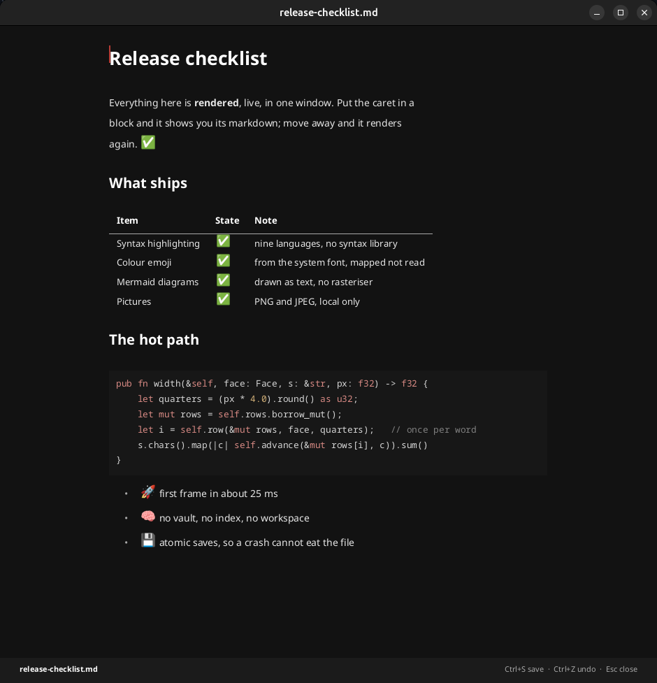
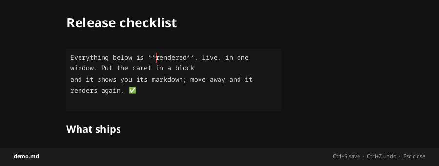

<div align="center">


# mdblaze

**Rendered markdown, on screen in 25 milliseconds. Close it and nothing is left running.**

[](https://github.com/Redstone-Logic/mdblaze/actions/workflows/ci.yml)
[](#licence)

</div>

---

You double-click a `.md` file.

- Your **browser** shows you `# raw text` with hashes and asterisks.
- **VS Code**, **Notepad++**, **vim**: raw text, or a preview pane you have to go
  and ask for, in a window that was already open because you left it open.
- **Obsidian** renders it properly — after an Electron runtime starts and your
  vault is indexed. For one file you wanted to read.

Nothing lives in the gap between "shows me the document" and "is already open".
That gap is the whole of this program.

<div align="center">

</div>

## Editing is the same window

No modes. No preview pane. No split view. The document is always rendered — and
the block your caret is in shows you its markdown, so you can change it. Move
away and it renders again.

<div align="center">

</div>

That is the entire editing model. There is nothing else to learn.

## Install

**Download it.** Builds for Linux, macOS (Apple silicon and Intel) and Windows
are on the [latest release](https://github.com/Redstone-Logic/mdblaze/releases/latest).
Unpack it, put the binary on your `PATH`, and that is the install — there is no
runtime to fetch and nothing left resident to keep updated.

```sh
tar xzf mdblaze-linux-x86_64.tar.gz
install -m755 mdblaze-linux-x86_64/mdblaze ~/.local/bin/
```

**Or build it**, if you already have a Rust toolchain:

```sh
cargo install mdblaze
```

Either way, once:

```sh
mdblaze --install-handler     # now double-clicking a .md file opens it
```

`--install-handler` works on Linux, macOS and Windows. It records whatever used
to open markdown and `--uninstall-handler` gives it back, because a program that
seizes a file association and cannot return it is one you should not have
installed.

## Use

```sh
mdblaze notes.md          # read it
mdblaze --timing notes.md # and say where the milliseconds went
```

| | |
|---|---|
| **click** | put the caret there — that block reveals its markdown |
| **Ctrl+O** | open a file — or drop one on the window |
| **Ctrl+S** | save, atomically. On an unnamed buffer it asks where |
| **Ctrl+Z** / **Ctrl+Y** | undo, redo |
| **Esc** | close — twice, quickly, to discard unsaved changes |

Arrows, Home, End, PageUp and PageDown do what they do everywhere.

### Opening a file

`Ctrl+O` asks the system for a path, so you get the chooser you already know —
Recent, your bookmarks, thumbnails, whatever your desktop provides. `Ctrl+S` on
a buffer that has no filename asks the same way.

Not a picker of our own. Typing a path is what `mdblaze notes.md` already does,
and a second way to type a path serves nobody: the people who need a chooser are
exactly the people who are not in a terminal.

It runs on its own thread. On Linux that call is a D-Bus round trip to
`xdg-desktop-portal`, which can be slow to activate or absent altogether — on the
event loop it would freeze the window with no repaint and no Escape until it
answered. Off the loop, the document stays live and the answer arrives when it
arrives.

## It renders the markdown you actually write

Headings, emphasis, lists, task lists, block quotes, tables, links.

**Fenced code, highlighted** without a syntax library — Rust, JS/TS, Python,
shell, Go, the C family, SQL, JSON, YAML and TOML. An unknown fence is shown
plain rather than guessed at.

**Mermaid diagrams**, drawn as box-drawing text. The SVG renderers need a
rasteriser, and the obvious one drags in a font database — the exact thing that
would cost more than this program's entire startup.

**Colour emoji**, from the font already on your machine. None is shipped: a
document with no emoji in it never even opens one.

**Pictures**, PNG and JPEG, from disk. Never from the network — a markdown file
arrives from anywhere, and one that says `` is asking this program
to tell a stranger which files you open and when. There is no setting for it.

## Why it is fast

Because it does not do the things that are slow. There is no document tree, no
HTML, no font system, no GPU context, no vault, no index and no workspace.

Minimum of twelve runs, 10 KB document:

| | |
|---|---|
| parse | 0.07 ms |
| lay out | 0.17 ms |
| draw a frame | 0.40 ms |
| **everything this program does** | **0.61 ms** |
| first frame on screen | **24.6 ms** |

The honest part: **96% of that wait is the windowing toolkit, not us.** `--timing`
says so out loud. Thirteen milliseconds of it is X11 parsing its 5,172-line
Compose table so that dead keys work — measured against `XCOMPOSEFILE=/dev/null`,
which takes the event loop from 19.4 ms to 6.4 ms. It is not disabled, because
typing `é` into a document is an ordinary thing to want.

A claim of "25 ms" that is really "1 ms of us and 24 of a dependency" stops being
true the moment somebody believes it, so it is written down.

## What it does not do, on purpose

**No settings.** The size, the measure and the leading are decided: 19px, about
66 characters a line, 1.55 leading — the middle of the band typographic practice
settled on. A document reader that asks you to configure your typography has
failed at the one job it has.

**No selection, no clipboard, no find.** Enough to fix a line. Not yet enough to
restructure a document.

**One file.** If you want a vault, you want Obsidian, and it is very good.

**Latin scripts only.** The faces are compiled into the binary, so CJK, Arabic
and Devanagari come out as missing glyphs. The fix is to embed more coverage, not
to start asking the operating system what fonts exist — which is the single most
reliable way to lose the entire budget.

**No colour emoji on Windows.** macOS and Linux store emoji as PNG strikes this
program already decodes; Segoe UI Emoji is layered vector glyphs with a palette,
which needs a different renderer.

## Releases

Prebuilt binaries for Linux, macOS (Apple silicon and Intel) and Windows are on
the [releases page](https://github.com/Redstone-Logic/mdblaze/releases), with a
`SHA256SUMS` alongside them.

The Linux build is made inside Debian 12 on purpose. A binary demands the glibc
it was linked against, so one built on a current CI image refuses to load on most
of the distributions people run — Debian 12 answers `version 'GLIBC_2.39' not
found` and stops there. Built in bookworm the floor is **glibc 2.34**, verified
running on Debian 12, Ubuntu 22.04 and Rocky 9. Debian 11 is the first release it
does not reach.

The binaries are not code-signed. macOS refuses a downloaded one until the
quarantine flag is off it — `xattr -d com.apple.quarantine mdblaze` — and Windows
SmartScreen warns the first time. A signing certificate is a yearly bill, this
program is free, and the `SHA256SUMS` file is there so you can check you got what
CI built rather than take anyone's word for it.

Each archive carries the licences with it, because the Noto faces compiled into
the binary are under the SIL Open Font License and that text has to travel with
any copy. See [NOTICE](NOTICE).

## Building

```sh
cargo test                                                  # 250 tests
cargo check --target aarch64-apple-darwin  --all-targets
cargo check --target x86_64-pc-windows-msvc --all-targets
```

CI runs the tests on Linux, macOS and Windows. Only Linux has been run by a
person; the other two are exercised by CI and by tests over the pure functions
that decide what gets written where. That is not the same as somebody using it,
and this does not claim otherwise.

## Licence

Dual licensed under [Apache-2.0](LICENSE-APACHE) or [MIT](LICENSE-MIT), at your
option — MIT because it is what most projects expect, Apache-2.0 because its
explicit patent grant is what some organisations need before they can use
anything at all.

The four Noto faces in `assets/fonts/` are **not** covered by either: they are
SIL Open Font License 1.1, and because they are compiled into the binary that
licence travels with any copy of it. See [NOTICE](NOTICE).

Copyright © 2026 Redstone Logic.
